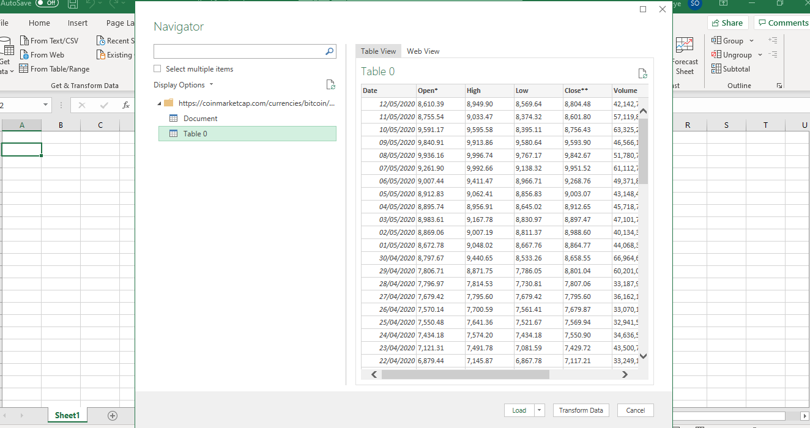
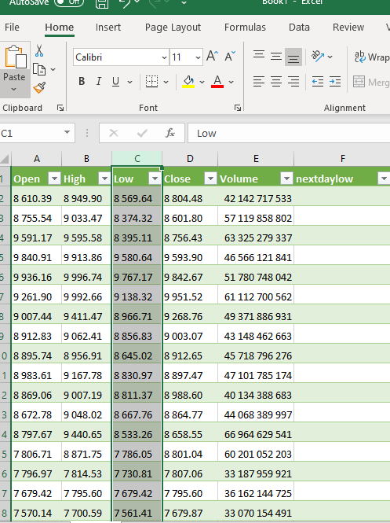

**Bitcoin, Stock Price prediction with Machine Learning**

In this little project I used bitcoin trading history to predict next day low
price. This can be a strategy for day traders who want to place a buy at a price
which is as close as possible to the next day low price. The strategy can also
be applied to stock price next day low price prediction. This however is not a
trading advice. You use this strategy at your own risk. I am a machine learning
enthusiast exploring the power of machine learning.

I divide this process into the following categories:

1.  Data source and how to import

2.  Converting data to csv

3.  Data observation and readjustment

4.  Machine learning method used

5.  Data pre-processing

6.  Network Training and Saving Trained model

7.  Predicting bitcoin next day low price with saved model

**Data Source and how to import:**

The data used is imported from
[www.coinmarketcap.com](http://www.coinmarketcap.com). It is better to import
the data than copying and pasting into excel sheet. If pasting is done, the data
get disorganized and becomes wrong while converting to csv. This is just my
little experience while working with it. Here is the method used to import the
data from the website:

-   Go to [www.coinmarketcap.com](http://www.coinmarketcap.com)

-   Click on bitcoin

-   Click on Historical data

-   In the data section select all time. This shows you the data from 2013

-   Copy the url in your browser after the historical data has
    displayed(https://coinmarketcap.com/currencies/bitcoin/historical-data/?start=20130429&end=20200513)

-   Open Microsoft excel and select data tab and click from web

-   Click ok

-   When prompted on which data to import table or document, select table

-   The data will then be imported.

-   Click load

Importing data

Loading data:

Loaded data to excel:

**Convert data to csv:**

To convert this data to csv, first we need to delete the date column and the
market cap column. We do not need them. The data should then look like this:

Secondly, we will remove all commas from the numbers by using search functions
to search for comma and replacing them with space. Then click replace all.

Thirdly, insert comma between each column data by using this formula in a new
column and dragging it down to the bottom.

=CONCATENATE(A1;",";B1;",";C1;",";D1;",";E1)

You may paste this at G1.

After dragging it down, the data looks like this:

**Data observation and readjustment:**

A close observation of the data shows that volume of trading has effect on the
highs and lows. There is a connection between how many traders trade each day
and the higher and lower the prices move. Since we are going to predict next day
low price. We need to show the neural network the existing next day lows against
the data of today that we have. By this I mean, place a new column in front of
each day and call it next day low. Then copy the next day (low) from the row
above each row and fill up the nextdaylow column. This way we will use this data
to show the neural network to develop an algorithm to predict what the next day
low price will be. Simply put, copy the (low) price data of 21st of October 2019
cell and insert it into the cell corresponding to the nextdaylow cell of 20th
October 2019.

Copying next day low:

Adjusting the formula

Delete the first row and copy the new data to notepad and save as csv

Open the csv file and use the search option to replace all space with no space
as we did for comma

**Machine learning method used:**

Supervised machine learning. We will use Keras to do this. Supervised machine
learning is the branch of machine learning where we train the model by showing
it input data and the expected result for that data, and it works out how to
transform the input into the expected output. We will do this by following a
process called; MODEL TRAIN, TEST, EVALUATION flow. We selected Neural Network
as machine learning algorithm we will be using with the aid of Keras. We train
the algorithm by showing it training data and the expected output for that data,
and it has to figure out how to replicate the expected result.

**Data pre-processing:**

Here I am going to convert the data(numbers) in the excel datasheet we have to
range between 0 and 1. The training of the data works well with this range of
data. Before doing this, I took out some days trading data from the csv file
created such that the data is divided into two different csv files containing
different days trading data. The names are:

"nextdaylow_training.csv"

"nextdaylow_test.csv"

After pre-processing the data, all the numbers are converted into a range of 0
to 1 and two different new csv files are created.

**Network Training:**

The two new csv files created are then used to train the neural network. Network
can be trained as many times as possible to obtain a more accurate network.
Watch out for a lesser error as network is being trained.

Here I trained the network and save the trained model to file so that we can
reuse the trained network for a future prediction. The for loop here is used to
train the first layer without human interference. The range function can be from
1 to 50. A neural network can be trained this way if you have an idea of the
error rate. We can special an error rate in the code and use for loop while we
allow the system to train itself until the desired error rate range is reached.

**Predicting bitcoin next day low price with saved model:**

During the pre-process section, we printed out the adjustment that the scaler
applied to the nextdaylow column of data using this print function:

print("Note: nextdaylow values were scaled by multiplying by {:.10f} and adding
{:.6f}".format(scaler.scale_[5], scaler.min_[5]))

We need scaler applied here in the prediction section. This is because we have
to convert our data from the 0 to 1 range back to what we had before.

In order to predict the nextdaylow price we need to load the saved trained model
and then use it to predict. The data I used to predict were not used at all in
the training process. The result of prediction will then show the integrity of
the model, especially as the data was not used for training. This is the data
fed into the trained model for prediction of the nextdaylow:

After prediction, this is the screen short:

Summary:

The good thing about this machine learning prediction model is the closeness of
the predicted data to the actual one. Though it is not very accurate as to
predict the numbers exactly, but it comes with some error which can be managed
with a very close observation of the discrepancies. For the day trader, the data
will have to be obtained at the end of each day trade and be quickly fed in as
the new day trades opens. Depending on the time zone, this might require waking
up at odd hour to do this.
